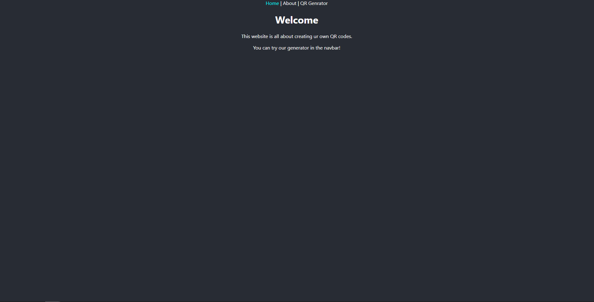
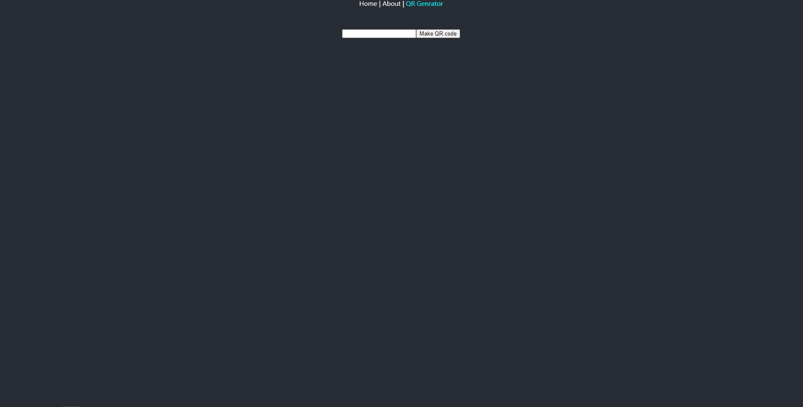
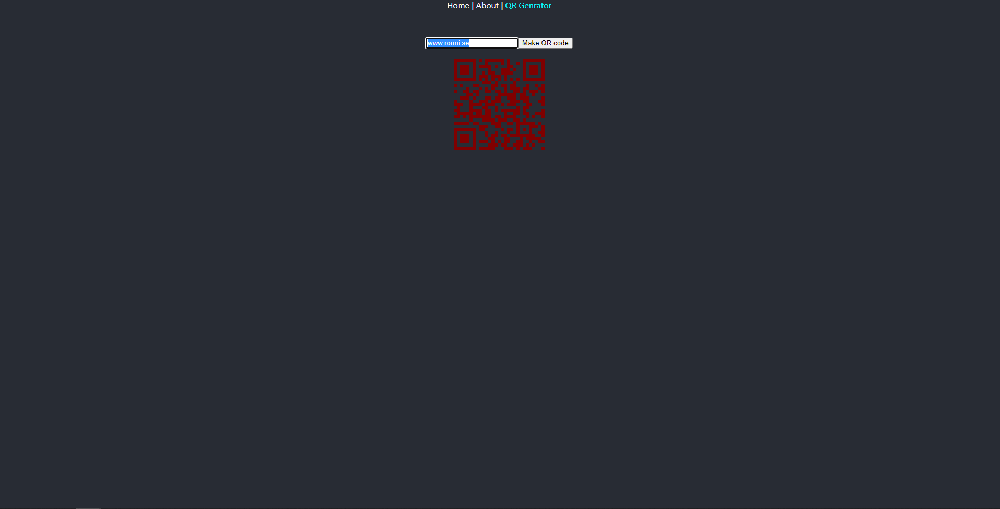
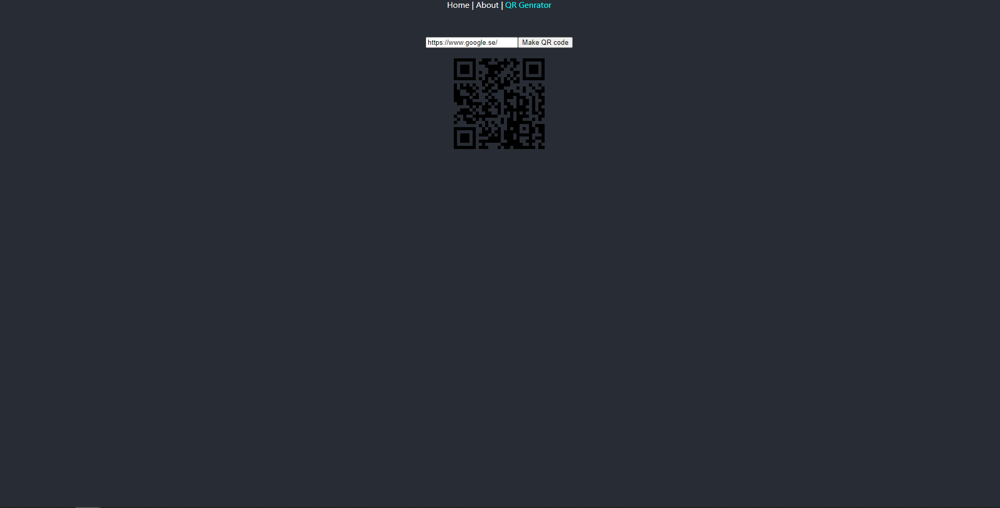

## QR generator

### The landingpage is Home with a welcome. 

### QR Generator-page 
is the part that you can generate a png image after you input a URL ex. https://github.com/. You can use this function how many times you like. 

When there is no input there is no QR code to display.

If the input is incorrect the QR code flags this with a red color.

When the QR code was correctly generated the QR code is black as usual.
### About-page
Where you can read up on what a QRcode is. 

